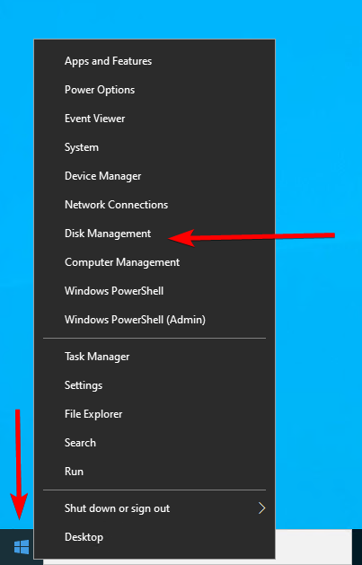
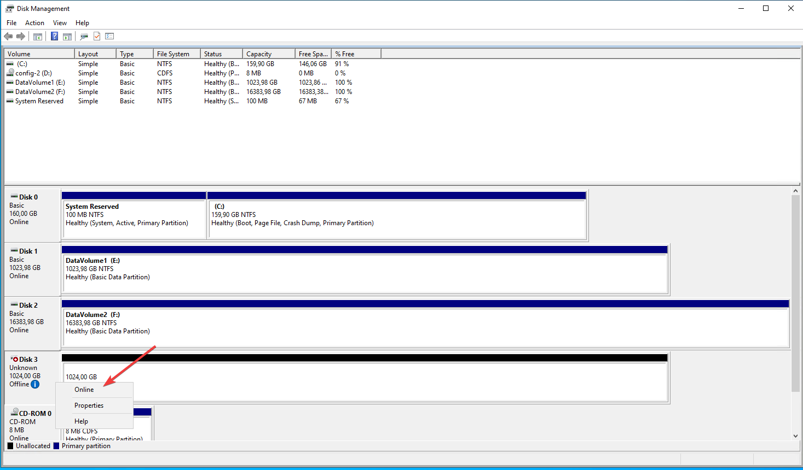
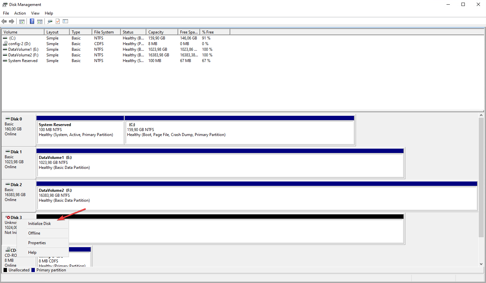
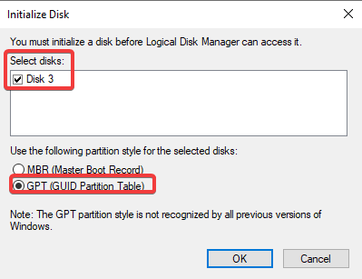
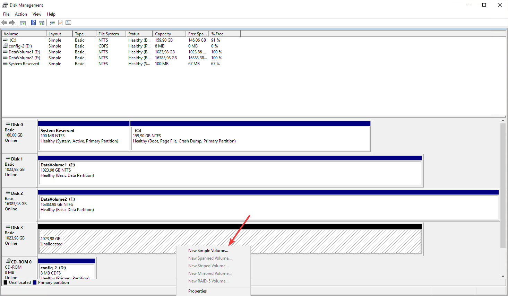

# Create a volume

Volumes are an essential part of OpenStack to store your data. Volumes are 
block storage devices that are attached to instances. They are independent
from the life cycle of the instance, and can be attached and detached to
instances as needed.

This articles will guide you through the process of creating a volume.

## Using the OpenStack Dashboard
Creating a volume through the OpenStack Dashboard is a simple process. 

**Step 1**  
Log in to the OpenStack Dashboard

**Step 2**  
Navigate to the `VOLUMES` section and click on `Volumes`

**Step 3**  
Click on `Create Volume` button right above the volume list.

**Step 4**  
Fill in the details of the volume you want to create. You can specify the size
of the volume, the availability zone, and the volume type. Please feel free
to change any of the example settings to your needs. 


- **Volume Name**: data-volume
- **Description**: This is a volume for storing data
- **Volume Source**: NO SOURCE, EMPTY VOLUME (please see the note below)
- **Type**: SSD (please see the note below)
- **Size (GiB)**: 10
- **Availability Zone**: ANY AVAILABILITY ZONE (please see the note below)
- **Group**: NO GROUP (please see the note below)

> **Note**: The `Volume Source` field is used to create a volume from an
existing volume, snapshot, or image. If you want to create an empty volume, 
select `NO SOURCE, EMPTY VOLUME`.

> **Note**: The `Type` field is often used to provide different specifications
or storage tiers. Some volume types might support volume encryption as well.
Most OpenStack providers provide distinct naming for encrypted volume types.

> **Note**: The `Availability Zone` field is used to specify the availability
zone where the volume will be created. This is important since volumes cannot
be attached to instances in different availability zones.

> **Note**: The `Group` field is used to specify the volume group where the
volume will be created. This is can be a handy tool if you have multiple volume
in your OpenStack environment and want to group them together.

**Step 5**  
Click on the small arrow button behind the newly created volume to see actions
menu and click on `Manage Attachments`

**Step 6**  
Select the instance you want to attach the volume to and click on
`Attach Volume` to attach the volume to the instance.

---

## Using the OpenStack CLI
Creating a volume through the OpenStack CLI can be a bit more complicated than
using the OpenStack Dashboard, but when you get the hang of it, it can be a
powerful tool.

**Step 1**  
First make sure you have setup the OpenStack CLI and that you are able to
execute commands using the `openstack` command. For more information please
refer to the
[Using the OpenStack CLI article](../getting-started/using-the-cli-linux.md).

**Step 2**  
Run the following command to create a volume:

```bash
openstack volume create --size <volume_size --type <volume_type> --availability-zone <availability_zone> <volume_name>
```
> **Note**: The `volume_type` is often used to provide different specifications
or storage tiers. Some volume types might support volume encryption as well.
Consult the documentation of your OpenStack providers to select the proper volume
type.

**Step 3**  
Check the status of the volume by running the following command:

```bash
openstack volume show <volume_name>
```

**Step 4**  
Attach the volume to an instance by running the following command:

```bash
openstack server add volume <instance_name/instance_id> <volume_name/volume_id>
```

---

## Mounting the volume within the instance
After you have created and attached the volume to an instance, you can mount
the volume within the instance. The process of mounting a volume is different
for each operating system.

Be default the volume is just empty diskspace which you can use as you like.
The following steps will guide you through the process of mounting the volume
an adding an filesystem to it so you can use it to store your data.

[Instruction for Linux](#linux)

[Instruction for Windows](#windows)

### Linux
**Step 1**  
You can identify the volume by its size and mountpoint. For example, if the
volume is 10GB and has no mountpoint, it is likely the volume you just
created. it will probably look simular to `/dev/sdb` but it may be different.

List the available disks on the instance by running the following command:

```bash
lsblk
```

> **Note**: The mountpoint displayed in OpenStack might not be the same as the
mountpoint in the instance.

**Step 2**  
Create a new partition on the volume by running the following command:

```bash
sudo fdisk <volume>
```

**Step 3**  
Format the partition by running the following command:

```bash
sudo mkfs.ext4 <volume>
```

> **Note**: You can choose any filesystem to format the partition. In this
example, we are using `ext4`.

**Step 4**  
Create a new directory to mount the volume by running the following command:

```bash
sudo mkdir /mnt/data-volume
```

> **Note**: You can choose any directory to mount the volume. In this example,
we are using `/mnt/data-volume`.

**Step 5**  
Mount the volume by running the following command:

```bash
sudo mount <volume> /mnt/data-volume
```

You can now use the volume to store your data.

---

#### Mounting the volume automatically
If you want to mount the volume automatically after a reboot, we need to add
an entry to the `/etc/fstab` file.

When managing multiple volumes on a single instance, it might be more feasible 
to use the procedure on 
[Identify cinder volumes from within the instance](identify-volumes.md).
Or use the steps below. Both procedures result in an automatically mounted volume

**Step 1**  
First we need to identify the volume by its UUID. You can do this by running
the following command:

You are looking for the UUID of the volume you just created. It will probably
look something like `85ca773c-a78b-415e-b1cd-2c4f1a1d267f`. Make sure you copy
the UUID of the correct volume. it should be the same path as in the steps
above (for example: `/dev/sdb`).

```bash
sudo blkid
```

**Step 2**  
Now we need to add an entry to the `/etc/fstab` file. We will use the UUID we
found in the previous step to identify the volume.

```bash
sudo nano /etc/fstab
```

Now add the following line to the bottom of the file:
```fstab
UUID=<linux_volume_id> /mnt/data-volume ext4 defaults 0 0
```

To save the file press `CTRL + X`, then `Y`, and then `ENTER`.

**Step 3**  
Test the `/etc/fstab` file by running the following command:

```bash
sudo mount -a
```

The volume should now be mounted automatically after a reboot. If you received
an error, please check the `/etc/fstab` file for any errors.

---

### Windows
**Step 1**  
Right-click the windows logo in the left bottom corner and click
on `Disk Management`.  


**Step 2**  
Right click on the Disk you want to prepare and online the disk to be able
to use the disk.  


**Step 3**  
Right click on the Disk you want to prepare and click on `Initialize Disk`.  


**Step 4**  
In the `Initialize Disk` window, select the disk you want to initialize, select
the `GPT (GUID Partition Table)` and click on `OK`.  


**Step 5**  
Right click on the unallocated space and click on `New Simple Volume`. You
can just click on `Next` in the `New Simple Volume Wizard` to use the default
settings. You can change the drive letter and the volume label if you want.  


Your disk is now ready to use, you can access it through Window Explorer and 
use the disk to store you data.
